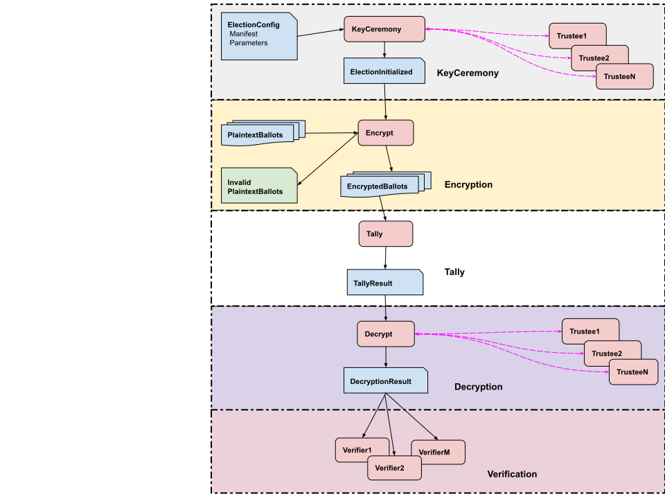

# EGK Workflow and Command Line Programs

last update 04/16/2024

<!-- TOC -->
* [EGK Workflow and Command Line Programs](#egk-workflow-and-command-line-programs)
  * [Election workflow overview](#election-workflow-overview)
  * [Make ekglib uberJar](#make-ekglib-uberjar)
  * [Election setup](#election-setup)
    * [Create a fake Election Manifest](#create-a-fake-election-manifest)
    * [Create an Election Configuration](#create-an-election-configuration)
    * [Run trusted KeyCeremony](#run-trusted-keyceremony)
    * [Create fake input ballots](#create-fake-input-ballots)
  * [Encryption](#encryption)
    * [Run AddEncryptedBallots](#run-addencryptedballots)
    * [Run Encrypt Ballot](#run-encrypt-ballot)
    * [Run Example Encryption](#run-example-encryption)
    * [Run Batch Encryption](#run-batch-encryption)
  * [Tally](#tally)
    * [Run Accumulate Tally](#run-accumulate-tally)
  * [Decryption](#decryption)
    * [Run trusted Tally Decryption](#run-trusted-tally-decryption)
    * [Run trusted Ballot Decryption](#run-trusted-ballot-decryption)
  * [Verify](#verify)
    * [Run Verifier](#run-verifier)
  * [Utility](#utility)
    * [Run ShowElectionRecord](#run-showelectionrecord)
    * [Run ShowSystem](#run-showsystem)
<!-- TOC -->

## Election workflow overview



1. **Create a Manifest record** 
   1. Generating a real Manifest by election officials is outside the scope of this library. That is to say,
      you must figure out what that looks like yourself, and use it as input to the library.
   2. Create a manifest in code with the _org.cryptobiotic.eg.election.Manifest_ classes, and write it out
          with a Publisher. 
   3. Create a fake manifest for testing with [_RunCreateTestManifest_ CLI](#create-a-fake-election-manifest).
   4. Use an existing fake manifest for testing in _src/commonTest/data/startManifest/manifest.json_.

2. **Create an ElectionConfig record**
   1. Create an ElectionConfig record from a Manifest and configuration values using [_RunCreateElectionConfig_ CLI](#create-an-election-configuration)

3. **Run the KeyCeremony**
   1. Create an ElectionInitialized record and decrypting trustees from an ElectionConfig by running a KeyCeremony with 
      [_RunTrustedKeyCeremony_ CLI](#run-trusted-keyceremony)
   2. To run a keyceremony with remote guardians, see the webapps CLI.

4. **Create test input plaintext ballots**
   1. Create fake input ballots for testing with [_RunCreateInputBallots_ CLI](#create-fake-input-ballots).
   1. _org.cryptobiotic.eg.workflow.GenerateFakeBallots_ (in the test code) generates random test ballots.
   2. Use existing fake ballots for testing in _src/test/data/fakeBallots_.

5. **Encryption**.
  1. The [_RunAddEncryptedBallots_ CLI](#run-addencryptedballots) reads plaintext ballots from a directory and 
     writes their encryptions into the specified election record.
  1. The [_RunEncryptBallot_ CLI](#run-encrypt-ballot) reads a plaintext ballot from disk and writes its encryption to disk.
  1. The [_RunExampleEncryption_ CLI](#run-example-encryption) Is an example of running RunEncryptBallot to encrypt ballots. 
     This can simulate more complex election records with multiple voting devices.
  1. The [_RunBatchEncryption_ CLI](#run-batch-encryption) reads plaintext ballots from a directory and writes their encryptions to the 
     specified election record. It is multithreaded.
  1. _org.cryptobiotic.eg.encrypt.AddEncryptedBallot_ is a class that your program calls to encrypt plaintext ballots
       and add them to the election record. (See _org.cryptobiotic.eg.cli.ExampleEncryption_ as an example of using AddEncryptedBallot). 
  1. To run encryption with the Encryption server, see the webapps CLI. This allows you to run the encryption on a 
      different machine than where ballots are generated, and/or to call from a non-JVM program.

6. **Accumulate Tally**.
    1. [_RunAccumulateTally_ CLI](#run-accumulate_tally) reads an ElectionInitialized record and EncryptedBallot
       records, sums the votes in the encrypted ballots and writes out an _EncryptedTally_ record.

7. **Decryption**.
    1. [_RunTrustedTallyDecryption_ CLI](#run-trusted-tally-decryption) reads an EncryptedTally and 
       local DecryptingTrustee records, decrypts the tally and writes out a _DecryptedTallyOrBallot_ record for the tally.
    2. [_RunTrustedBallotDecryption_ CLI](#run-trusted-ballot-decryption) reads "spoiled" ballot records and 
       local DecryptingTrustee records, decrypts the ballots and writes out a _DecryptedTallyOrBallot_ for each ballot.
    3. To run decryption with remote guardians, see the webapps CLI.

8. **Verify**. 
    1. [_VerifyElectionRecord_ CLI](#run-verifier) reads an election record and verifies it.

9. **Complete test Workflow**.
    1. A complete test workflow can be run by _org.cryptobiotic.eg.workflow.TestWorkflow_ (in the test code).

## Make ekglib uberJar

For classpath simplicity, the examples below use the [ekglib uberJar](https://github.com/JohnLCaron/egk-ec/blob/main/docs/GettingStarted.md#building-a-library-with-all-dependencies-uber-jar).

## Election setup

### Create a fake Election Manifest

````
Usage: RunCreateTestManifest options_list
Options: 
    --ncontests, -ncontests -> number of contests (always required) { Int }
    --nselections, -nselections -> number of selections per contest (always required) { Int }
    --outputType, -type [JSON] -> JSON or PROTO { String }
    --outputDir, -out -> Directory to write test manifest file (always required) { String }
    --help, -h -> Usage info 
````

Example:

````
java -classpath build/libs/egk-ec-2.1-SNAPSHOT-uber.jar \
  org.cryptobiotic.eg.cli.RunCreateTestManifest \
    -ncontests 3 \
    -nselections 11 \
    -out testOut/cliWorkflow/manifest 
````

### Create an Election Configuration

````
Usage: RunCreateElectionConfig options_list
Options: 
    --electionManifest, -manifest -> Manifest file or directory (always required) { String }
    --groupName, -group -> Group name  ('P-256' or 'Integer4096') (always required) { String }
    --nguardians, -nguardians -> number of guardians (always required) { Int }
    --quorum, -quorum -> quorum size (always required) { Int }
    --outputDir, -out -> Directory to write output ElectionInitialized record (always required) { String }
    --createdBy, -createdBy [RunCreateElectionConfig] -> who created { String }
    --baux0, -device [device] -> device information, used for B_aux,0 from eq 58-60 { String }
    --chainCodes, -chainCodes [false] -> chain confirmation codes 
    --help, -h -> Usage info 
````

If chainCodes is true, and baux0 is omitted, then the device name UTF-8 bytes will be used when creating the 
confirmation codes during encryption. This allows the configuration file to be used across multiple devices, 
and still have the device name as part of the ballot chaining as required in the spec. 
So, in general we recommend ommitting baux0 here, unless you have special requirements.

Example:

````
java -classpath build/libs/egk-ec-2.1-SNAPSHOT-uber.jar \
  org.cryptobiotic.eg.cli.RunCreateElectionConfig \
    -manifest src/test/data/startManifest \
    -group P-256 \
    -nguardians 3 \
    -quorum 3 \
    -out testOut/cliWorkflow/configEc
````

### Run trusted KeyCeremony

This has access to all the trustees, so is only used for testing, or in a use case of trust. 
Otherwise, use the [remote keyceremony webapps](https://github.com/JohnLCaron/egk-webapps#remote-keyceremony).

````
Usage: RunTrustedKeyCeremony options_list
Options: 
    --inputDir, -in -> Directory containing input election record (always required) { String }
    --trusteeDir, -trustees -> Directory to write private trustees (always required) { String }
    --outputDir, -out -> Directory to write output ElectionInitialized record (always required) { String }
    --createdBy, -createdBy [RunTrustedKeyCeremony] -> who created { String }
    --help, -h -> Usage info 
````

Example:

````
java -classpath build/libs/egk-ec-2.1-SNAPSHOT-uber.jar \
  org.cryptobiotic.eg.cli.RunTrustedKeyCeremony \
    -in testOut/cliWorkflow/configEc \
    -trustees testOut/cliWorkflow/keyceremonyEc/trustees \
    -out testOut/cliWorkflow/keyceremonyEc
````

### Create fake input ballots

````
Usage: RunCreateInputBallots options_list
Options: 
    --manifestDirOrFile, -manifest -> Manifest file or directory (always required) { String }
    --outputDir, -out -> Directory to write plaintext ballots (always required) { String }
    --nballots, -n [11] -> Number of ballots to generate { Int }
    --isJson, -json -> Generate Json ballots (default to manifest type) 
    --help, -h -> Usage info 
````

Example:

````
java -classpath build/libs/egk-ec-2.1-SNAPSHOT-uber.jar \
  org.cryptobiotic.eg.cli.RunCreateInputBallots \
    -manifest src/test/data/startManifest \
    -out testOut/generateInputBallots \
    -n 100 
````

## Encryption

Encryption is usually done on the voting device; running your own program linked into the egk-ec library gives you 
maximum flexibility for voter challenges and ballot handling. The Encryption server (part of the webapps CLIs) 
also allows voter challenges. The CLIs documented here have less flexibility but are easier to use.

### Run AddEncryptedBallots

````
Usage: RunExampleEncryption options_list
Options: 
    --inputDir, -in -> Directory containing input election record (always required) { String }
    --ballotDir, -ballots -> Directory to read Plaintext ballots from (always required) { String }
    --device, -device -> voting device name (always required) { String }
    --outputDir, -out -> Directory to write output election record (always required) { String }
    --challengePct, -challenge [0] -> Challenge percent of ballots { Int }
    --help, -h -> Usage info  
````

This reads plaintext ballots from ballotDir and writes their encryptions into the specified election record.

If the config file has chainConfirmationCodes = true, then the ballots will be chained.

Pass in "--challengePct percent" to simulate challenging this percent of ballots, randomly chosen.

Example:

````
java -classpath build/libs/egk-ec-2.1-SNAPSHOT-uber.jar \
  org.cryptobiotic.eg.cli.RunAddEncryptedBallots \
    -in src/test/data/encrypt/testBallotChain \
    -ballot src/test/data/fakeBallots \
    -device device42 \
    -out testOut \
    -challenge 10
````

### Run Encrypt Ballot

````
Usage: RunEncryptBallot options_list
Options: 
    --inputDir, -in -> Directory containing input election record (always required) { String }
    --device, -device -> voting device name (always required) { String }
    --ballotFilepath, -ballot -> Plaintext ballot filepath (or 'CLOSE') (always required) { String }
    --outputDir, -out -> Directory to write output election record (always required) { String }
    --encryptBallotDir, -output -> Write encrypted ballot to this directory (always required) { String }
    --noDeviceNameInDir, -deviceDir [false] -> Dont add device name to encrypted ballots directory 
    --help, -h -> Usage info 
 
````
This reads one plaintext ballot from disk and writes its encryption into the specified election record, which must already exist.

The standard place to write encrypted ballots is _encryptBallotDir_ = _outputDir/encrypted_ballots/device/_. If not chaining, you may
specify --noDeviceNameInDir, then the encryptions are written to _outputDir/encrypted_ballots/_.

The encrypted file is always named _eballot-ballotId.json_, where _ballotId_ is taken from the plaintext ballot.

If the config file has chainConfirmationCodes = true, then RunEncryptBallot will expect to be able to read
and write _ballot_chain.json_ in the _encryptBallotDir_ directory. The ballot chaining should be closed by sending 
ballotFilename = "CLOSE" when the chain is complete.

Example:

````
java -classpath build/libs/egk-ec-2.1-SNAPSHOT-uber.jar \
  org.cryptobiotic.eg.cli.RunEncryptBallot \
    -in src/test/data/encrypt/testBallotNoChain \
    -ballot src/test/data/fakeBallots/pballot-id153737325.json \
    -device device42 \
    -out testOut
````

### Run Example Encryption

````
Usage: RunExampleEncryption options_list
Options: 
    --inputDir, -in -> Directory containing input election record (always required) { String }
    --nballots, -nballots -> Number of test ballots to generate (always required) { Int }
    --plaintextBallotDir, -pballotDir -> Write plaintext ballots to this directory (always required) { String }
    --deviceNames, -device -> voting device name(s), comma delimited (always required) { String }
    --outputDir, -out -> Directory to write output election record (always required) { String }
    --noDeviceNameInDir, -deviceDir [false] -> Dont add device name to encrypted ballots directory 
    --help, -h -> Usage info 
````
This is an example program that calls RunEncryptBallot to encrypt one ballot at a time, by generating fake ballots.
All ballots are cast (no challenges). It is meant as an example, not something used in production.

There must be at least one device name. You can generate multiple chains by having multiple device names. 
In that case the ballots are randomly assigned to a device in the list. 

Chaining is controlled by the config file flag chainConfirmationCodes = true. If true, then RunExampleEncryption will
close the chain when done, and will add the device name to the encryption directory. If not chaining, then the device name
will not be added to the encryption directory.

Example:

````
java -classpath build/libs/egk-ec-2.1-SNAPSHOT-uber.jar \
  org.cryptobiotic.eg.cli.RunExampleEncryption \
    -in src/test/data/encrypt/testBallotChain \
    -nballots 33 \
    -pballotDir testOut/encrypt/RunExampleEncryptionTest/plaintext_ballots \
    -device device42,device11,yrnameHere
    --outputDir testOut/encrypt/RunExampleEncryptionTest \
````

### Run Batch Encryption

````
Usage: RunBatchEncryption options_list
Options: 
    --inputDir, -in -> Directory containing input election record (always required) { String }
    --ballotDir, -ballots -> Directory to read Plaintext ballots from (always required) { String }
    --invalidDir, -invalid -> Directory to write invalid input ballots to { String }
    --check, -check [None] -> Check encryption { Value should be one of [none, verify, encrypttwice, decryptnonce] }
    --nthreads, -nthreads [11] -> Number of parallel threads to use { Int }
    --createdBy, -createdBy -> who created { String }
    --device, -device -> voting device name (always required) { String }
    --outputDir, -out -> Directory to write output election record { String }
    --noDeviceNameInDir, -deviceDir -> Dont add device name to encrypted ballots directory
    --anonymize, -anon [false] -> anonymize ballot 
    --help, -h -> Usage info 
````

This reads all plaintext ballot from ballotDir and writes their encryptions into outputDir or encryptDir.

You must specify either outputDir or encryptDir. The former copies ElectionInit and writes encrypted ballots to standard election record.
The latter writes just the encrypted ballots to the specified directory.

This runs multithreaded, and you cannot use it to do ballot chaining or challenges.

Example:

````
java -classpath build/libs/egk-ec-2.1-SNAPSHOT-uber.jar \
  org.cryptobiotic.eg.cli.RunBatchEncryption \
    -in src/test/data/keyceremony/runFakeKeyCeremonyAllEc \
    -ballots src/test/data/fakeBallots \
    -device device42 \
    -out testOut/testBatchEncryption
````

## Tally

### Run Accumulate Tally

````
Usage: RunAccumulateTally options_list
Options: 
    --inputDir, -in -> Directory containing input ElectionInitialized record and encrypted ballots (always required) { String }
    --outputDir, -out -> Directory to write output election record (always required) { String }
    --encryptDir, -eballots -> Read encrypted ballots here (optional) { String }
    --name, -name -> Name of tally { String }
    --countNumberOfBallots, -count [false] -> count number of ballots for each contest 
    --createdBy, -createdBy -> who created { String }
    --help, -h -> Usage info 
````

Example:

````
java -classpath build/libs/egk-ec-2.1-SNAPSHOT-uber.jar \
  org.cryptobiotic.eg.cli.RunAccumulateTally \
    -in testOut/cliWorkflow/electionRecordEc \
    -out testOut/cliWorkflow/electionRecordEc 
````

output:

* outputDir/encrypted_tally.json

Note that at this point in the cliWorkflow example, we are both reading from and writing to the electionRecord. A
production workflow may be significantly different.


## Decryption

### Run trusted Tally Decryption

This has access to all the trustees, so is only used for testing, or in a use case of trust.
Otherwise, use the [remote decryption webapp](https://github.com/JohnLCaron/egk-webapps#remote-decryption).

````
Usage: RunTrustedTallyDecryption options_list
Options: 
    --inputDir, -in -> Directory containing input election record (always required) { String }
    --trusteeDir, -trustees -> Directory to read private trustees (always required) { String }
    --outputDir, -out -> Directory to write output election record (always required) { String }
    --encryptedTallyFile, -encryptedTally -> encryptedTally file (if different from the one in the election record) { String }
    --createdBy, -createdBy -> who created { String }
    --missing, -missing -> missing guardians' xcoord, comma separated, eg '2,4' { String }
    --help, -h -> Usage info 
````

Example:

````
java -classpath build/libs/egk-ec-2.1-SNAPSHOT-uber.jar \
  org.cryptobiotic.eg.cli.RunTrustedTallyDecryption \
    -in testOut/cliWorkflow/electionRecordEc \
    -trustees testOut/cliWorkflow/keyceremonyEc/trustees \
    -out testOut/cliWorkflow/electionRecordEc
````

output:
* outputDir/tally.json

### Run trusted Ballot Decryption

This has access to all the trustees, so is only used for testing, or in a use case of trust.
Otherwise, use the [remote decryption webapp](https://github.com/JohnLCaron/egk-webapps#remote-decryption).

````
Usage: RunTrustedBallotDecryption options_list
Options: 
    --inputDir, -in -> Directory containing input election record (always required) { String }
    --trusteeDir, -trustees -> Directory to read private trustees (always required) { String }
    --outputDir, -out -> Directory to write output election record (always required) { String }
    --decryptChallengedList, -challenged -> decrypt challenged ballots { String }
    --nthreads, -nthreads -> Number of parallel threads to use { Int }
    --help, -h -> Usage info 
````

The decryptSpoiledList may be:

1. a comma-delimited (no spaces) list of ballot Ids
2. a fully-qualified filename of a text file containing ballot Ids (one per line)
3. "All" -> decrypt all the ballots
4. "challenged" or omitted -> decrypt the ballots that have been marked CHALLENGED.

Example:

````
java -classpath build/libs/egk-ec-2.1-SNAPSHOT-uber.jar \
  org.cryptobiotic.eg.cli.RunTrustedBallotDecryption \
    -in testOut/cliWorkflow/electionRecordEc \
    -trustees testOut/cliWorkflow/keyceremonyEc/trustees \
    -challenged All \
    -out testOut/cliWorkflow/electionRecordEc
````

output:

* outputDir/challenged_ballots/

## Verify

### Run Verifier

```` 
Usage: RunVerifier options_list
Options: 
    --inputDir, -in -> Directory containing input election record (always required) { String }
    --nthreads, -nthreads [11] -> Number of parallel threads to use { Int }
    --showTime, -time [false] -> Show timing 
    --help, -h -> Usage info
````

Example:

````
java -classpath build/libs/egk-ec-2.1-SNAPSHOT-uber.jar \
  org.cryptobiotic.eg.cli.RunVerifier \
  -in testOut/cliWorkflow/electionRecordEc
````

## Utility

### Run ShowElectionRecord

```` 
Usage: RunElectionRecordShow options_list
Options: 
    --inputDir, -in -> Directory containing input Election Record (always required) { String }
    --show, -show -> [all,constants,manifest,guardians,trustees,ballots] { String }
    --details, -details -> show details 
    --ballotStyle, -ballotStyle -> for just one ballot style { String }
    --help, -h -> Usage info 
````

Example:

````
java -classpath build/libs/egk-ec-2.1-SNAPSHOT-uber.jar \
  org.cryptobiotic.eg.cli.RunShowElectionRecord \
  -in src/test/data/workflow/allAvailableEc \
  -show all,constants,manifest,guardians,trustees,ballots
````

Example:

````
java -classpath build/libs/egk-ec-2.1-SNAPSHOT-uber.jar \
  org.cryptobiotic.eg.cli.RunShowElectionRecord \
  -in /home/stormy/tmp/testOut/egkec/encrypt/testRunEncryptBallotNoChainingBut \
  -show ballots
````

### Run ShowSystem

```` 
Usage: RunShowSystem options_list
Options: 
    --show, -show -> [properties,java.library.path,hasVEC] { String }
    --setPath, -set -> set java.library.path { String }
    --help, -h -> Usage info 
````

Example:

````
java -classpath build/libs/egk-ec-2.1-SNAPSHOT-uber.jar \
  org.cryptobiotic.eg.cli.RunShowSystem \
  -show properties,java.library.path,hasVEC
````
